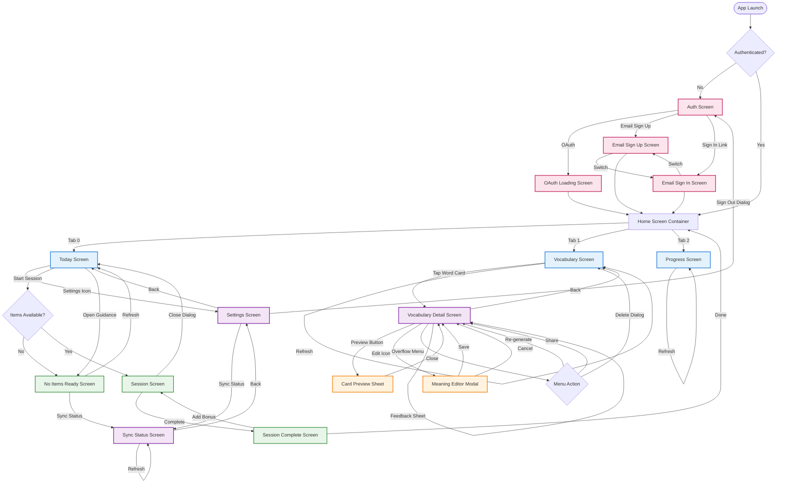

# Mastery App Screen Flows & Action Hierarchy

**Generated:** 2026-02-08
**Purpose:** Complete navigation map and action hierarchy analysis for UX design system

---

## Table of Contents
1. [Screen Inventory](#screen-inventory)
2. [Navigation Flow Diagram](#navigation-flow-diagram)
3. [Screen Template Classification](#screen-template-classification)
4. [Action Hierarchy Analysis](#action-hierarchy-analysis)
5. [Violations & Design Debt](#violations--design-debt)

---

## Screen Inventory

### Main Navigation (Bottom Nav)
1. **Today Screen** - Daily decision screen, session entry
2. **Vocabulary Screen** - List of all vocabulary with search/filter
3. **Progress Screen** - Stats, streak, outcomes

### Auth Flow
4. **Auth Screen** - Welcome/OAuth sign in options
5. **Email Sign In Screen** - Email/password sign in
6. **Email Sign Up Screen** - Create account with email

### Learning Flow
7. **Session Screen** - Active practice session
8. **Session Complete Screen** - Post-session summary
9. **No Items Ready Screen** - Empty state guidance

### Detail Screens
10. **Vocabulary Detail Screen** - Single word detail view
11. **Settings Screen** - User preferences and account

### Status & Sync
12. **Sync Status Screen** - Import/enrichment pipeline status
13. **OAuth Loading Screen** - OAuth callback handler

### Modals/Sheets
14. **Card Preview Sheet** - Preview all card types for a word
15. **Meaning Editor** - Full-screen meaning edit modal

---

## Navigation Flow Diagram



---

## Screen Template Classification

### List Screen Template
**Characteristics:** Scrollable list, search/filter, item tap navigation, refresh

| Screen | Search | Filter | Actions | Violations |
|--------|--------|--------|---------|------------|
| **Vocabulary Screen** | ✅ Search bar | ✅ 3 filter chips | Refresh (pull), Tap to detail | None |

**Action Pattern:**
- **Primary:** Tap item → Detail screen
- **Secondary:** Search, filter chips (inline)
- **Tertiary:** Pull-to-refresh
- **Future risk:** Add vocabulary, bulk actions, export

---

### Detail Screen Template
**Characteristics:** Single item view, scrollable content, action bar at bottom

| Screen | Primary Action | Secondary Actions | Tertiary Actions | Violations |
|--------|---------------|-------------------|------------------|------------|
| **Vocabulary Detail** | ❓ Preview Cards? | Edit (header icon) | Overflow menu (re-generate, share, delete) | **VIOLATION: Unclear primary, overflow with feedback hidden** |
| **Today Screen** | Start/Continue Session | Settings icon (header) | Pull-to-refresh | Good hierarchy |
| **Progress Screen** | None | None | Pull-to-refresh | Good (read-only) |
| **Settings Screen** | None | List items (tappable) | Sign out (destructive) | Good (grouped list) |
| **Sync Status Screen** | Refresh button | None | None | Good |

**Vocabulary Detail Violations:**
- **Multiple primaries?** "Preview" treated as primary, but "reading the word" is actual primary
- **Feedback buried:** Thumbs up/down/flag moved from visible to menu
- **4+ buttons:** Initial design had 5 buttons (overflow)
- **Inconsistent pattern:** Doesn't match other detail screens

---

### Edit Modal Template
**Characteristics:** Full-screen or sheet, form fields, save/cancel actions

| Screen | Type | Primary Action | Secondary Action | Violations |
|--------|------|---------------|------------------|------------|
| **Meaning Editor** | Full-screen modal | Save | Cancel | None |
| **Email Sign Up** | Full-screen | Create Account | Sign in link | None |
| **Email Sign In** | Full-screen | Sign In | Sign up link, show password | None |

**Action Pattern:**
- **Primary:** Save/Submit (bottom button, full width)
- **Secondary:** Cancel (back button or explicit cancel)
- **Tertiary:** Field-level actions (show password)

---

### Practice Screen Template
**Characteristics:** Full-screen interaction, timer/progress, grading buttons

| Screen | Primary Actions | Secondary Actions | Tertiary Actions | Violations |
|--------|-----------------|-------------------|------------------|------------|
| **Session Screen** | Grade buttons (Again/Hard/Good/Easy) | Pause, Close (with dialog) | Timer (passive) | **VIOLATION: 4 grade buttons can overflow on small cards** |
| **Session Complete** | Done (go home) | +2min Bonus (optional) | None | Good hierarchy |
| **No Items Ready** | Refresh Availability | Check Sync Status | None | Good |

**Session Screen Violations:**
- **Grade button overflow:** Recall cards show 4 buttons (Again/Hard/Good/Easy) which can overflow on small screens
- **Future risk:** Adding hint, skip, report actions will worsen overflow

---

### Modal/Sheet Template
**Characteristics:** Overlay, dismissible, focused task

| Screen | Type | Primary Action | Secondary Actions | Violations |
|--------|------|---------------|------------------|------------|
| **Card Preview Sheet** | Bottom sheet (92% height) | Swipe between cards | Close button | None |
| **Auth Screen** | Full screen | OAuth buttons | Email sign up, sign in link | None |
| **OAuth Loading** | Full screen | Automatic redirect | None | N/A |

**Action Pattern:**
- **Primary:** Inline interaction (swipe, tap cards)
- **Secondary:** Close/dismiss
- **Tertiary:** Page indicators (dots)

---

## Action Hierarchy Analysis

### By Action Type

#### Navigation Actions
| Action | Screens | Current Pattern | Violations |
|--------|---------|----------------|------------|
| **Back/Close** | Most screens | Back button (header), Close icon, or gesture | Consistent ✅ |
| **Bottom Nav** | Home container | 3 tabs (Today, Vocabulary, Progress) | Consistent ✅ |
| **Tap Item** | Vocabulary list | InkWell on WordCard | Consistent ✅ |
| **Settings** | Today screen | Icon in header | Consistent ✅ |

#### Content Actions
| Action | Screens | Current Pattern | Violations |
|--------|---------|----------------|------------|
| **Preview Cards** | Vocabulary detail | TextButton with icon (secondary style) | **VIOLATION: Treated as primary** |
| **Edit** | Vocabulary detail | Header icon | Good ✅ |
| **Refresh** | Multiple | Pull-to-refresh + button | Inconsistent ❓ |
| **Start Session** | Today screen | Full-width button in hero card | Good ✅ |

#### Feedback Actions
| Action | Screens | Current Pattern | Violations |
|--------|---------|----------------|------------|
| **Thumbs up/down** | Vocabulary detail | Hidden in feedback sheet | **VIOLATION: Was visible, now buried** |
| **Flag issue** | Vocabulary detail | Hidden in feedback sheet | **VIOLATION: Was visible, now buried** |
| **Grade card** | Session screen | 4 visible buttons | **VIOLATION: Can overflow** |

#### Destructive Actions
| Action | Screens | Current Pattern | Violations |
|--------|---------|----------------|------------|
| **Delete** | Vocabulary detail | Overflow menu → confirm dialog | Good ✅ |
| **Sign out** | Settings | Red list item → confirm dialog | Good ✅ |
| **Close session** | Session screen | Icon → confirm dialog | Good ✅ |

#### Data Actions
| Action | Screens | Current Pattern | Violations |
|--------|---------|----------------|------------|
| **Re-generate** | Vocabulary detail | Overflow menu | **VIOLATION: Important but hidden** |
| **Search** | Vocabulary list | Persistent search bar | Good ✅ |
| **Filter** | Vocabulary list | Chip group (all, enriched, not enriched) | Good ✅ |
| **Add Bonus** | Session complete | Outline button (optional) | Good ✅ |

---

## Violations & Design Debt

### Critical Issues

#### 1. Vocabulary Detail Screen - Action Hierarchy Chaos
**Location:** `/mobile/lib/features/vocabulary/vocabulary_detail_screen.dart:459-543`

**Problem:**
```
Current: [Preview (TextButton)] [⋮ Overflow Menu]
         └─ Contains: Re-generate, Share, Delete

Hidden in menu:
├─ Re-generate AI Enrichment (important!)
├─ Share (standard action)
└─ Delete (destructive)

Hidden in separate feedback sheet:
├─ Thumbs up (positive feedback)
├─ Thumbs down (negative feedback)
└─ Flag issue
```

**Why it's wrong:**
- **No clear primary:** Is the primary action "reading the word" or "previewing cards"?
- **Feedback buried twice:** User must tap "Suggest edit" → open sheet → choose feedback
- **Re-generate buried:** Important action (regenerate AI) hidden in overflow
- **Initial design overflow:** First attempt had 5 visible buttons (24px overflow on iPhone SE)

**Design Questions:**
- Should Preview be primary? (Current treatment suggests yes, but semantically no)
- Should feedback be always visible? (Was visible, then hidden for "too many options")
- Should re-generate be elevated? (It's an important quality control action)

---

#### 2. Session Screen - Grade Button Overflow
**Location:** `/mobile/lib/features/learn/screens/session_screen.dart:657-762`

**Problem:**
```
Recall mode shows 4 buttons:
[Again] [Hard] [Good] [Easy]

On small cards with long content, buttons can overflow or wrap awkwardly.
```

**Why it's wrong:**
- **4 primary actions:** Too many competing primaries
- **Button scaling:** Buttons don't gracefully degrade on small screens
- **Future bloat:** Adding skip/hint/report will worsen overflow

**Design Questions:**
- Can we reduce to 3 buttons? (Again/Good/Easy, remove Hard?)
- Should buttons be icon-only on small screens?
- Should less common actions move to a menu?

---

#### 3. Inconsistent Refresh Patterns
**Problem:**
```
Today Screen:        Pull-to-refresh
Progress Screen:     Pull-to-refresh
Vocabulary Screen:   Pull-to-refresh + "Refresh" button in empty state
No Items Screen:     "Refresh Availability" button (no pull-to-refresh)
Sync Status Screen:  "Refresh Status" button (no pull-to-refresh)
```

**Why it's wrong:**
- Users expect consistent refresh mechanism
- Some screens have button, some don't
- No clear rule for when to use pull vs button

**Design Questions:**
- Should all list/content screens support pull-to-refresh?
- Should buttons be backup or primary?
- What about screens that can't scroll?

---

### Medium Priority Issues

#### 4. Bottom Sheet vs Full-Screen Modal Inconsistency
**Problem:**
- **Card Preview:** Bottom sheet (92% height)
- **Meaning Editor:** Full-screen modal via Navigator.push
- **Feedback Sheet:** Bottom sheet (showModalBottomSheet)
- **Settings Sheets:** Bottom sheet for picker options

**Why it's inconsistent:**
- No clear rule for when to use sheet vs modal
- Meaning Editor is form → should be modal (correct)
- Card Preview is tall sheet → could be modal
- Feedback sheet is small → sheet is correct

**Design Questions:**
- When should we use sheets vs modals?
- Should Card Preview be full-screen like Meaning Editor?

---

#### 5. Empty States Have Different Action Patterns
**Problem:**
```
Vocabulary empty (no vocab):     "Refresh" button (secondary)
Vocabulary filtered (no results): No action, just message
No Items Ready screen:            "Refresh" + "Sync Status" (two primaries?)
```

**Why it's inconsistent:**
- No standard pattern for empty state actions
- Some have actions, some don't
- Multiple primaries in No Items screen

---

### Low Priority Issues

#### 6. Settings Screen - Dev Mode Easter Egg
**Location:** `/mobile/lib/features/settings/presentation/screens/settings_screen.dart:159-178`

**Issue:** Version item has long-press to toggle dev mode

**Why it's minor:**
- Hidden feature, intentionally undiscoverable
- Not part of user-facing UX
- But worth documenting pattern

---

## Screen-by-Screen Action Breakdown

### Today Screen
**Template:** Dashboard/Hero Card
**Actions:**
- **Primary:** Start/Continue Session (button in hero card)
- **Secondary:** Settings (header icon)
- **Tertiary:** Pull-to-refresh
- **Status:** ✅ Clean hierarchy, no violations

---

### Vocabulary Screen
**Template:** List Screen
**Actions:**
- **Primary:** Tap word card → detail
- **Secondary:** Search bar, filter chips
- **Tertiary:** Pull-to-refresh
- **Future risk:** Add vocabulary, bulk actions, export
- **Status:** ✅ Currently good, but will need action hierarchy when adding features

---

### Vocabulary Detail Screen
**Template:** Detail Screen
**Actions:**
- **Primary:** ❓ Unclear (Preview Cards? Reading content?)
- **Secondary:** Edit (header icon), Preview button
- **Tertiary:** Overflow menu (re-generate, share, delete)
- **Hidden:** Feedback (thumbs, flag) in separate sheet
- **Status:** 🔴 **CRITICAL VIOLATION** - unclear hierarchy, buried actions, overflow issues

---

### Session Screen
**Template:** Practice Screen
**Actions:**
- **Primary:** Grade buttons (Again/Hard/Good/Easy) - **4 buttons!**
- **Secondary:** Pause, Close
- **Tertiary:** Timer (passive)
- **Status:** ⚠️ **VIOLATION** - 4 grade buttons can overflow

---

### Session Complete Screen
**Template:** Result Screen
**Actions:**
- **Primary:** Done (go home)
- **Secondary:** +2min Bonus (conditional, outline button)
- **Status:** ✅ Clean hierarchy

---

### No Items Ready Screen
**Template:** Empty State
**Actions:**
- **Primary:** Refresh Availability
- **Secondary:** Check Sync Status
- **Status:** ✅ Good, though arguably 2 primaries

---

### Settings Screen
**Template:** Grouped List
**Actions:**
- **Primary:** None (read/navigate)
- **Secondary:** List items (tappable → sheets)
- **Destructive:** Sign out (red list item)
- **Status:** ✅ Clean hierarchy

---

### Sync Status Screen
**Template:** Status Dashboard
**Actions:**
- **Primary:** Refresh Status
- **Status:** ✅ Single clear action

---

### Card Preview Sheet
**Template:** Modal/Sheet
**Actions:**
- **Primary:** Swipe between cards (inline)
- **Secondary:** Close button
- **Status:** ✅ Clean interaction

---

### Auth Screens
**Template:** Auth Flow
**Actions:**
- **Auth Screen:** OAuth buttons (3 options), Sign in link
- **Sign Up/Sign In:** Form submit, switch link, show password
- **Status:** ✅ Standard auth patterns

---

## Summary Statistics

| Template | Count | Violations | Notes |
|----------|-------|------------|-------|
| **List Screen** | 1 | 0 | Vocabulary screen is clean, but will need patterns for future features |
| **Detail Screen** | 5 | 1 | Vocabulary detail has critical action hierarchy issues |
| **Edit Modal** | 3 | 0 | Forms follow standard pattern |
| **Practice Screen** | 3 | 1 | Session screen grade buttons can overflow |
| **Modal/Sheet** | 3 | 0 | Consistent patterns |
| **Auth** | 4 | 0 | Standard auth flows |

**Total Screens:** 15 user-facing + 4 auth = 19
**Critical Violations:** 2
**Medium Issues:** 3
**Low Issues:** 1

---

## Recommendations for Design System

### 1. Define Action Hierarchy Levels
Based on analysis, we need clear definitions:

- **Primary (1 max):** The main user intent for this screen
- **Secondary (2-3):** Common supporting actions, always visible
- **Tertiary (3+):** Less common actions, can be in menu
- **Feedback (special):** Quality/issue reporting, needs consistent pattern
- **Destructive (special):** Dangerous actions, always with confirmation

### 2. Standard Patterns by Template

**List Screen:**
- Primary: Tap item
- Secondary: Search, filter (inline)
- Tertiary: Add, bulk, export (FAB or overflow)

**Detail Screen:**
- Primary: Single most important action (bottom sticky)
- Secondary: Edit, share (header or secondary buttons)
- Tertiary: Less common actions (overflow menu)
- Feedback: Dedicated pattern (inline? menu? sheet?)

**Practice Screen:**
- Primary: Grade/answer (max 3 buttons to avoid overflow)
- Secondary: Pause, skip (header)
- Tertiary: Settings, report (menu)

### 3. Resolve Vocabulary Detail Screen
**Proposed fix:**
```
┌─────────────────────────────────┐
│ ← [Word Header]          [Edit] │ ← Edit in header
├─────────────────────────────────┤
│                                 │
│ [Word content, meaning, etc]    │
│                                 │
│                                 │
├─────────────────────────────────┤
│ Bottom sticky bar:              │
│ [Preview Cards] [👍] [⋮ Menu]   │ ← Feedback visible, overflow for rest
│   Primary      Feedback  More   │
└─────────────────────────────────┘

Menu contains:
- Re-generate AI
- Share
- Delete
```

**Rationale:**
- Preview as primary (most users want to see cards)
- Feedback visible (one-tap access to quality control)
- Destructive/advanced actions in menu
- Edit in header (standard pattern)

### 4. Grade Button Redesign
**Current:** [Again] [Hard] [Good] [Easy] (4 buttons)
**Proposed:** [Again] [Good] [Easy] (3 buttons) + Hard in menu if needed

Or use progressive disclosure:
```
Initial: [Again] [Good]
After reveal: [Again] [Hard] [Good] [Easy]
```

---

## Next Steps

1. **Designer review** - Validate analysis and violations
2. **Define hierarchy framework** - Clear rules for categorization
3. **Create component patterns** - Visual designs for each level
4. **Apply to problem screens** - Fix Vocabulary Detail and Session first
5. **Document patterns** - Update design system docs
6. **Implement incrementally** - Roll out fixes screen by screen

---

## Appendix: File Locations

### Screen Files
- **Today:** `/mobile/lib/features/home/presentation/screens/today_screen.dart`
- **Vocabulary List:** `/mobile/lib/features/vocabulary/presentation/screens/vocabulary_screen.dart`
- **Vocabulary Detail:** `/mobile/lib/features/vocabulary/vocabulary_detail_screen.dart`
- **Progress:** `/mobile/lib/features/progress/presentation/screens/progress_screen.dart`
- **Session:** `/mobile/lib/features/learn/screens/session_screen.dart`
- **Session Complete:** `/mobile/lib/features/learn/screens/session_complete_screen.dart`
- **No Items:** `/mobile/lib/features/learn/screens/no_items_ready_screen.dart`
- **Settings:** `/mobile/lib/features/settings/presentation/screens/settings_screen.dart`
- **Sync Status:** `/mobile/lib/features/sync/presentation/screens/sync_status_screen.dart`
- **Auth:** `/mobile/lib/features/auth/presentation/screens/auth_screen.dart`
- **Sign In:** `/mobile/lib/features/auth/presentation/screens/email_sign_in_screen.dart`
- **Sign Up:** `/mobile/lib/features/auth/presentation/screens/email_sign_up_screen.dart`
- **OAuth Loading:** `/mobile/lib/features/auth/presentation/screens/oauth_loading_screen.dart`

### Modal/Sheet Files
- **Card Preview:** `/mobile/lib/features/vocabulary/presentation/widgets/card_preview_sheet.dart`
- **Meaning Editor:** `/mobile/lib/features/vocabulary/presentation/widgets/meaning_editor.dart`

### Navigation
- **Main:** `/mobile/lib/main.dart` (Bottom nav container)
- **Auth Guard:** `/mobile/lib/features/auth/auth_guard.dart`
