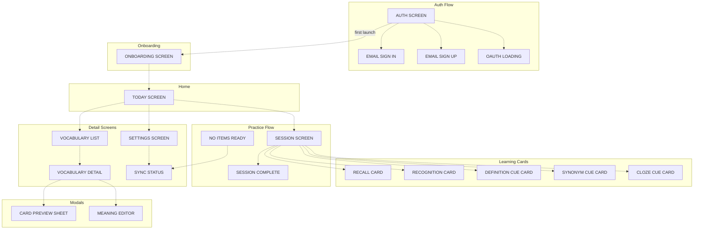

# Mastery App Screen Flows & Action Hierarchy

**Purpose:** Complete navigation map and action hierarchy analysis for all screens. Single source of truth for UX design system.

---

## Screen Action Hierarchy Map

### Action Hierarchy by Screen

**Legend:** P = Primary, S = Secondary, T = Tertiary, D = Destructive, O = Overflow

| Screen | P | S | T | D/O |
|---|---|---|---|---|
| **Today** | Start session (ShadButton) | Review anyway (ShadButton.outline, when completed), Settings icon | Pull-to-refresh, Vocabulary card tap (InkWell) | |
| **Session** | — | Close (IconButton) | | |
| **Learning Cards** (Recall, Recognition, Definition, Synonym, Cloze) | Grade buttons (Again/Hard/Good/Easy) | Show hint (Definition, Cloze only), Flag issue | | |
| **Session Complete** | Done (go home) | +2min Bonus (when isFullCompletion and !allItemsExhausted) | | |
| **No Items Ready** | Refresh Availability | Check Sync Status | | |
| **Vocabulary List** | Tap word | Search, Filter chips | Pull-to-refresh | |
| **Vocabulary Detail** | — (reference screen) | Edit (header icon), Preview (outlined) | Suggest edit (muted) | O: Re-generate, Share, Delete |
| **Settings** | — (navigation) | List items (tappable) | | D: Sign out |
| **Sync Status** | Refresh Status | | | |
| **Card Preview Sheet** | Swipe between cards | Close button | | |
| **Meaning Editor** | Save (filled, sticky) | Cancel, Dismiss | | |
| **Auth** | OAuth buttons | Email sign up/in links | | |
| **Email Sign In** | Sign In (submit) | Sign up link, Show password | | |
| **Email Sign Up** | Create Account | Sign in link | | |
| **OAuth Loading** | — (spinner) | | | |
| **Onboarding** | Get Started / Continue | Skip | Swipe between pages | |

---

## Design Debt

### Unresolved Issues

1. **Inconsistent refresh patterns**
   - **Problem:** Today/Vocabulary have pull-to-refresh; Vocabulary Detail, Sync Status, No Items do not
   - **Needed:** Rule for when to use pull-to-refresh vs button (proposal: scrollable content screens get pull-to-refresh, non-scrollable get button)

2. **Flag issue uses AlertDialog instead of bottom sheet**
   - **Problem:** All other picker UIs use `showModalBottomSheet`, but flag issue category picker uses `showDialog`
   - **Needed:** Make flag issue picker consistent with other pickers

3. **Grade button code duplication**
   - **Problem:** 5 card files have near-identical grade button code. `recall_card.dart` extracts to `_GradeButton` class, others use inline methods
   - **Needed:** Extract shared grade button widget

4. **GestureDetector used for "Show hint" instead of InkWell**
   - **Problem:** `definition_cue_card.dart` and `cloze_cue_card.dart` use `GestureDetector` for the "Show hint" tap target
   - **Needed:** Replace with `InkWell` per project conventions (better tap detection and visual feedback in complex widget hierarchies)

5. **"Step 1 of 2" / "Step 2 of 2" helper text in cue cards**
   - **Problem:** `DefinitionCueCard`, `SynonymCueCard`, and `ClozeCueCard` show step-number helper text
   - **Needed:** Remove — conflicts with "minimal cognitive noise" design principle. Users learn card flow through interaction, not instruction.

6. **OnboardingScreen uses raw FilledButton instead of ShadButton**
   - **Problem:** `onboarding_screen.dart` uses `FilledButton` directly, inconsistent with rest of app which uses `ShadButton`
   - **Needed:** Replace with `ShadButton` for consistency

7. **DisambiguationCard is dead code**
   - **Problem:** `_parseDisambiguationOptions` always returns empty options, causing fallback to `RecallCard`. The `disambiguation_card.dart` widget is never rendered.
   - **Needed:** Remove dead code or implement disambiguation logic

---

## Appendix: File Locations

### Screen Files
- **Today:** `mobile/lib/features/home/presentation/screens/today_screen.dart`
- **Vocabulary List:** `mobile/lib/features/vocabulary/presentation/screens/vocabulary_screen.dart`
- **Vocabulary Detail:** `mobile/lib/features/vocabulary/vocabulary_detail_screen.dart`
- **Progress:** `mobile/lib/features/progress/presentation/screens/` *(empty directory — placeholder)*
- **Session:** `mobile/lib/features/learn/screens/session_screen.dart`
- **Session Complete:** `mobile/lib/features/learn/screens/session_complete_screen.dart`
- **No Items:** `mobile/lib/features/learn/screens/no_items_ready_screen.dart`
- **Settings:** `mobile/lib/features/settings/presentation/screens/settings_screen.dart`
- **Sync Status:** `mobile/lib/features/sync/presentation/screens/sync_status_screen.dart`
- **Auth:** `mobile/lib/features/auth/presentation/screens/auth_screen.dart`
- **Sign In:** `mobile/lib/features/auth/presentation/screens/email_sign_in_screen.dart`
- **Sign Up:** `mobile/lib/features/auth/presentation/screens/email_sign_up_screen.dart`
- **OAuth Loading:** `mobile/lib/features/auth/presentation/screens/oauth_loading_screen.dart`
- **Onboarding:** `mobile/lib/features/onboarding/onboarding_screen.dart`

### Learning Card Widgets
- **RecallCard:** `mobile/lib/features/learn/widgets/recall_card.dart`
- **RecognitionCard:** `mobile/lib/features/learn/widgets/recognition_card.dart`
- **DefinitionCueCard:** `mobile/lib/features/learn/widgets/definition_cue_card.dart`
- **SynonymCueCard:** `mobile/lib/features/learn/widgets/synonym_cue_card.dart`
- **ClozeCueCard:** `mobile/lib/features/learn/widgets/cloze_cue_card.dart`
- **DisambiguationCard (dead code):** `mobile/lib/features/learn/widgets/disambiguation_card.dart`

### Other Widgets
- **SessionProgressBar:** `mobile/lib/features/learn/widgets/session_progress_bar.dart`
- **BottomNavBar (unused):** `mobile/lib/core/widgets/bottom_nav_bar.dart`
- **WordCard:** `mobile/lib/core/widgets/word_card.dart`

### Modal/Sheet Files
- **Card Preview:** `mobile/lib/features/vocabulary/presentation/widgets/card_preview_sheet.dart`
- **Meaning Editor:** `mobile/lib/features/vocabulary/presentation/widgets/meaning_editor.dart`

### Navigation
- **Main:** `mobile/lib/main.dart`
- **Auth Guard:** `mobile/lib/features/auth/auth_guard.dart`
- **Approach:** All navigation is imperative `Navigator.push`/`pop`/`pushReplacement`/`popUntil` — no GoRouter, no named routes.
