# Mastery App Screen Flows & Action Hierarchy

**Purpose:** Complete navigation map and action hierarchy analysis for all screens. Single source of truth for UX design system.

---

## Screen Action Hierarchy Map

```mermaid
graph TB
    subgraph "Main Navigation (Bottom Nav)"
        Today["<b>TODAY SCREEN</b><br/>Template: Dashboard<br/>━━━━━━━━━━━━━━━<br/>🔴 Start/Continue Session<br/>🟡 Settings (header icon)<br/>⚪ Pull-to-refresh"]
        Vocab["<b>VOCABULARY SCREEN</b><br/>Template: List<br/>━━━━━━━━━━━━━━━<br/>🔴 Tap word → Detail<br/>🟡 Search, Filter chips<br/>⚪ Pull-to-refresh"]
        Progress["<b>PROGRESS SCREEN</b><br/>Template: Dashboard<br/>━━━━━━━━━━━━━━━<br/>🔴 None (read-only)<br/>⚪ Pull-to-refresh"]
    end

    subgraph "Detail Screens"
        VocabDetail["<b>VOCABULARY DETAIL</b><br/>Template: Reference (no primary)<br/>━━━━━━━━━━━━━━━<br/>🔴 None (reference screen)<br/>🟡 Edit (header icon), Preview (bottom, outlined)<br/>⚪ Suggest edit (inline, muted)<br/>📦 Re-generate, Share, Delete"]
        Settings["<b>SETTINGS SCREEN</b><br/>Template: Grouped List<br/>━━━━━━━━━━━━━━━<br/>🔴 None (navigation)<br/>🟡 List items (tappable)<br/>❌ Sign out (destructive)"]
        SyncStatus["<b>SYNC STATUS</b><br/>Template: Status Dashboard<br/>━━━━━━━━━━━━━━━<br/>🔴 Refresh Status"]
    end

    subgraph "Practice Flow"
        Session["<b>SESSION SCREEN</b><br/>Template: Practice<br/>━━━━━━━━━━━━━━━<br/>🔴 Grade buttons (Again/Hard/Good/Easy)<br/>🟡 Pause, Close<br/>📦 Session settings, Report"]
        SessionComplete["<b>SESSION COMPLETE</b><br/>Template: Result<br/>━━━━━━━━━━━━━━━<br/>🔴 Done (go home)<br/>🟡 +2min Bonus (optional)"]
        NoItems["<b>NO ITEMS READY</b><br/>Template: Empty State<br/>━━━━━━━━━━━━━━━<br/>🔴 Refresh Availability<br/>🟡 Check Sync Status"]
    end

    subgraph "Modals & Sheets"
        CardPreview["<b>CARD PREVIEW SHEET</b><br/>Template: Bottom Sheet<br/>━━━━━━━━━━━━━━━<br/>🔴 Swipe between cards<br/>🟡 Close button"]
        MeaningEditor["<b>MEANING EDITOR</b><br/>Template: Edit Modal<br/>━━━━━━━━━━━━━━━<br/>🔴 Save (filled, sticky)<br/>🟡 Cancel, ✕ Dismiss"]
    end

    subgraph "Auth Flow"
        Auth["<b>AUTH SCREEN</b><br/>Template: Auth<br/>━━━━━━━━━━━━━━━<br/>🔴 OAuth buttons<br/>🟡 Email sign up/in links"]
        SignIn["<b>EMAIL SIGN IN</b><br/>Template: Form<br/>━━━━━━━━━━━━━━━<br/>🔴 Sign In (submit)<br/>🟡 Sign up link, Show password"]
        SignUp["<b>EMAIL SIGN UP</b><br/>Template: Form<br/>━━━━━━━━━━━━━━━<br/>🔴 Create Account<br/>🟡 Sign in link"]
    end

    %% Navigation connections (simplified)
    Today -.-> Session
    Today -.-> Settings
    Vocab -.-> VocabDetail
    VocabDetail -.-> CardPreview
    VocabDetail -.-> MeaningEditor
    Session -.-> SessionComplete
    Settings -.-> SyncStatus
    NoItems -.-> SyncStatus
```

**Legend:**
- 🔴 Primary action
- 🟡 Secondary action
- ⚪ Tertiary action
- 📦 Overflow menu
- ❌ Destructive action

---

## Design Debt

### Unresolved Issues

1. **Inconsistent refresh patterns**
   - **Problem:** Today/Progress/Vocabulary have pull-to-refresh; Vocabulary Detail, Sync Status, No Items do not
   - **Needed:** Rule for when to use pull-to-refresh vs button (proposal: scrollable content screens get pull-to-refresh, non-scrollable get button)

2. **Flag issue uses AlertDialog instead of bottom sheet**
   - **Problem:** All other picker UIs use `showModalBottomSheet`, but flag issue category picker uses `showDialog`
   - **Needed:** Make flag issue picker consistent with other pickers

3. **Grade button code duplication**
   - **Problem:** 4 card files have near-identical grade button code. `recall_card.dart` extracts to `_GradeButton` class, other 3 use inline methods
   - **Needed:** Extract shared grade button widget

---

## Appendix: File Locations

### Screen Files
- **Today:** `/mobile/lib/features/home/presentation/screens/today_screen.dart`
- **Vocabulary List:** `/mobile/lib/features/vocabulary/presentation/screens/vocabulary_screen.dart`
- **Vocabulary Detail:** `/mobile/lib/features/vocabulary/vocabulary_detail_screen.dart`
- **Progress:** `/mobile/lib/features/progress/presentation/screens/progress_screen.dart`
- **Session:** `/mobile/lib/features/learn/screens/session_screen.dart`
- **Session Complete:** `/mobile/lib/features/learn/screens/session_complete_screen.dart`
- **No Items:** `/mobile/lib/features/learn/screens/no_items_ready_screen.dart`
- **Settings:** `/mobile/lib/features/settings/presentation/screens/settings_screen.dart`
- **Sync Status:** `/mobile/lib/features/sync/presentation/screens/sync_status_screen.dart`
- **Auth:** `/mobile/lib/features/auth/presentation/screens/auth_screen.dart`
- **Sign In:** `/mobile/lib/features/auth/presentation/screens/email_sign_in_screen.dart`
- **Sign Up:** `/mobile/lib/features/auth/presentation/screens/email_sign_up_screen.dart`
- **OAuth Loading:** `/mobile/lib/features/auth/presentation/screens/oauth_loading_screen.dart`

### Modal/Sheet Files
- **Card Preview:** `/mobile/lib/features/vocabulary/presentation/widgets/card_preview_sheet.dart`
- **Meaning Editor:** `/mobile/lib/features/vocabulary/presentation/widgets/meaning_editor.dart`

### Navigation
- **Main:** `/mobile/lib/main.dart` (Bottom nav container)
- **Auth Guard:** `/mobile/lib/features/auth/auth_guard.dart`
